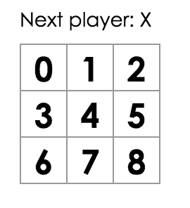
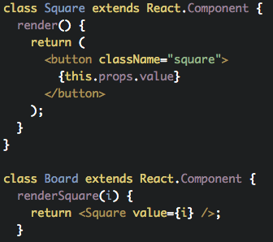
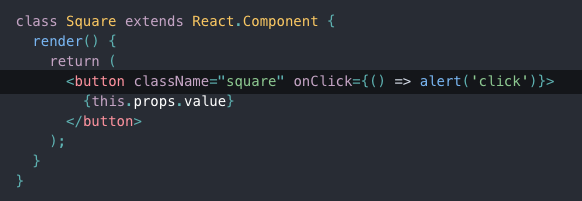
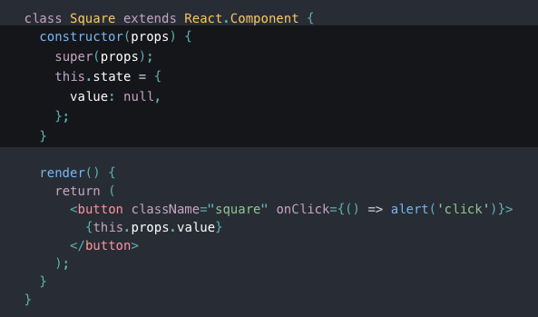
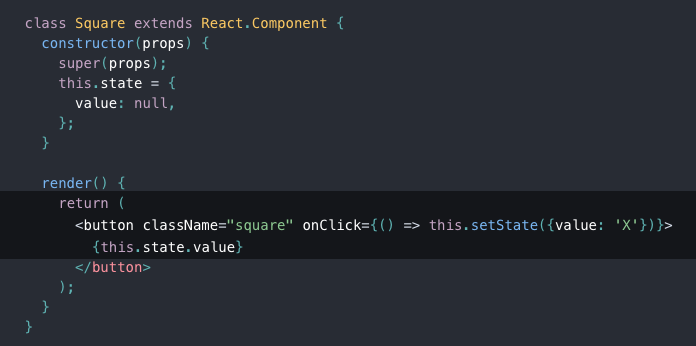
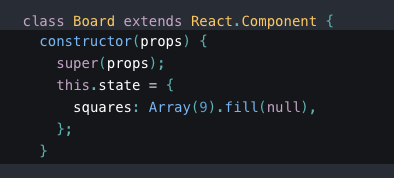
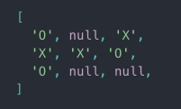
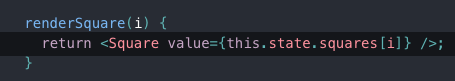
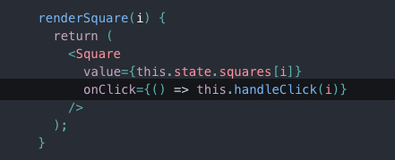

## Tic Tac React

An implementation of the Tic-Tac-Toc game with React

+ Clone the repository or create the React app

+ Review the starting code

Starting code: https://codepen.io/gaearon/pen/oWWQNa?editors=0010

+ You can put the starting code in a single file for now!

### Step 1

+ Passing Data Through Props (Board -> Square)

Expected result:

#### Solution:

In Board’s renderSquare method, change the code to pass a value prop to the Square.
Then change Square’s render method to show that value by replacing TODO with {this.props.value}:

Updated code:
https://codepen.io/gaearon/pen/aWWQOG?editors=0010

### Step 2

Let’s make the Square component fill in an “X” when you click it. Try changing the button tag returned in the render() function of the Square like this:

Initialize the state:

Now change the Square render method to display the value from the current state, and to toggle it on click:

#### Debug it and see what's happening!!!

### Step 3

Add a constructor to the Board and set its initial state to contain an array with 9 nulls, corresponding to the 9 squares:

We’ll fill it in later so that a board looks something like

Modify it to pass a value prop to Square.

This is the code now: https://codepen.io/gaearon/pen/gWWQPY?editors=0010

### Step 4

Now we need to change what happens when a square is clicked. The Board component now stores which squares are filled, which means we need some way for Square to update the state of Board. Since component state is considered private, we can’t update Board’s state directly from Square.

The usual pattern here is pass down a function from Board to Square that gets called when the square is clicked. Change renderSquare in Board again so that it reads:

Now we’re passing down two props from Board to Square: value and onClick. The latter is a function that Square can call. 

+ Let’s make the following changes to Square:

-> Replace this.state.value with this.props.value in Square’s render.

-> Replace this.setState() with this.props.onClick() in Square’s render.

-> Delete constructor definition from Square because it doesn’t have state anymore.

BUT: Try clicking a square – you should get an error because we haven’t defined handleClick yet. 

-> Add it to the Board class.

